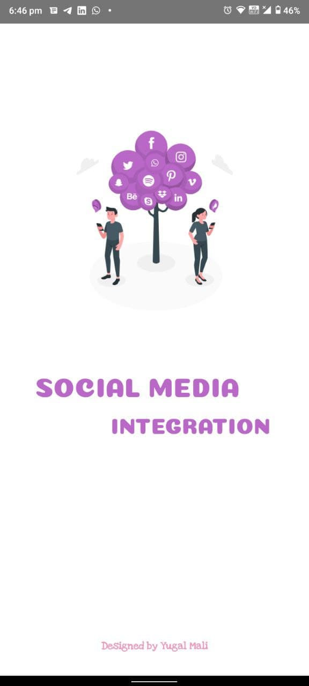
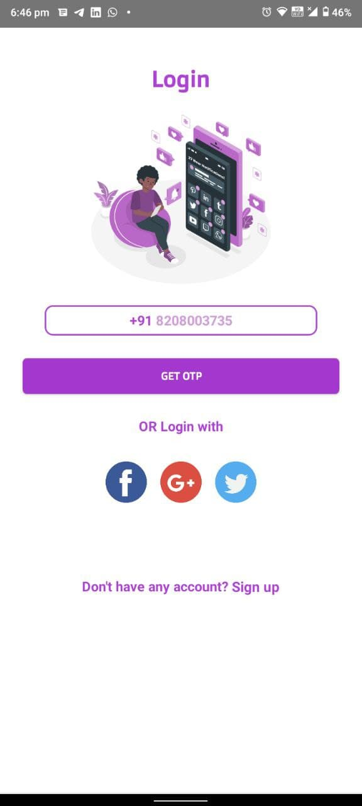
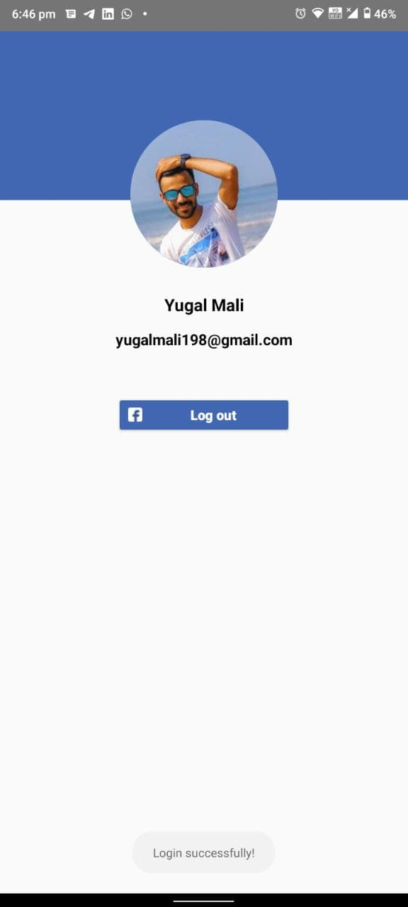
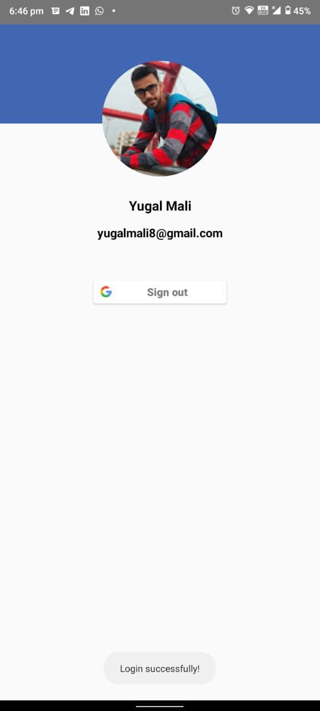

# Social Media Integration
## Description
* User can login using Google api & Facebook api.
* Also User can login using Otp Authication System
* Tech Stack :- Android Studio, Java, Firebase, Google Api, Facebook Api, Firebase Authication.

## Screenshots
### SplashScreen

### Login Page

### Facebook 
 

### Google
 

### User Authication using Otp

### Wrong Otp

### Home Screen 

### Project Explanation
<iframe width="300" height="535"
src="Screenshot/sample.mp4">
</iframe>

